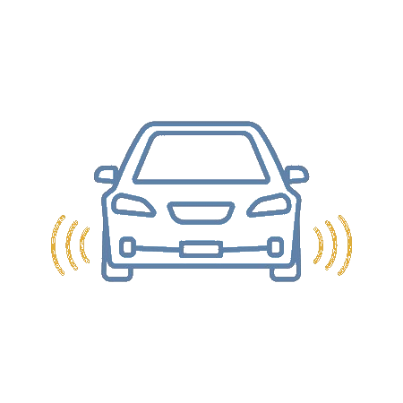

[![Contributors][contributors-shield]][contributors-url]
[![Forks][forks-shield]][forks-url]
[![Stargazers][stars-shield]][stars-url]
[![Issues][issues-shield]][issues-url]
[![LinkedIn][linkedin-shield]][linkedin-url]


<!-- PROJECT LOGO -->
<br />
<p align="center">
  <a href="https://github.com/haitham-chabayta/self-driving-car">
     
 </a>

  <h3 align="center">Self Driving car</h3>

  <p align="center">
    Robotic car that avoids coliding with surrounding objects
    <br />
    <a href="https://github.com/haitham-chabayta/self-driving-car"><strong>Explore the docs »</strong></a>
    <br />
    <br />
    <a href="https://github.com/haitham-chabayta/self-driving-car/blob/master/Demo-Video1.mp4">View Demo</a>
    ·
    <a href="https://github.com/haitham-chabayta/self-driving-car/issues">Report Bug</a>
    ·
    <a href="https://github.com/haitham-chabayta/self-driving-car/issues">Request Feature</a>
  </p>
</p>


<!-- TABLE OF CONTENTS -->
## Table of Contents

* [About the Project](#about-the-project)
  * [Built With](#built-with)
  * [Features](#features)
* [Getting Started](#getting-started)
  * [Prerequisites](#prerequisites)
  * [Installation](#installation)
* [Contributing](#contributing)
* [Contact](#contact)
* [Acknowledgements](#acknowledgements)


<!-- ABOUT THE PROJECT -->
## About The Project

[![Screen Shot][product-screenshot]](https://github.com/haitham-chabayta/self-driving-car/)

Self driving is a small robotic car that detects surrounding objects using two ultrasonic sensors connected to an Arduino. Once an ultrasonic sensor detects a close object the car will reverse back and move into the opposite direction. The car has a DC Motor for each wheel and the motors are connected to a H-bridge to control their speed and direction. The car will also display after it has been turned off the distance it covered and the time taken to cover that distance using an LCD screen on the back of the car.

A list of commonly used resources that I find helpful are listed in the acknowledgements.

### Features
* Accurate object detection and quick response time
* RGB LED that turns green when the car is moving and turns red when it detects a close object
* Displays distance covered and time taken


### Built With
* [Arduino IDE](https://www.arduino.cc/en/main/software)

## Getting Started
Here is the list of the prerequisites you need and how to install the system.

### Prerequisites

*Small robotic car chassis

*Arduino microcontroller 

*2 Ultrasonic sensors

*4 DC Motors 

*H-bridge

*Arduino IDE / Download from : https://www.arduino.cc/en/main/software

*Git / Check if you have Git using:
```sh
npm --version
```
If not install git from https://git-scm.com/downloads


### Installation

1. Clone the Repo 
```sh
git clone https://github.com/haitham-chabayta/self-driving-car.git
```
2. Import the ardunio code from the repo into arduino IDE and install the code on the arduino

3. Connect the 4 DC Motors to the H-bridge

4. Connect the H-bridge to the Arduino

5. Place one ultrasonic on each side of the car and connect them to the arduino

<!-- CONTRIBUTING -->
## Contributing

Contributions are what make the open source community such an amazing place to be learn, inspire, and create. Any contributions you make are **greatly appreciated**.

1. Fork the Project
2. Create your Feature Branch (`git checkout -b feature/AmazingFeature`)
3. Commit your Changes (`git commit -m 'Add some AmazingFeature'`)
4. Push to the Branch (`git push origin feature/AmazingFeature`)
5. Open a Pull Request


<!-- CONTACT -->
## Contact

Haitham Chabayta - haithamchabayta@gmail.com

LinkedIn: https://www.linkedin.com/in/haitham-chabayta-0654681b1/


<!-- ACKNOWLEDGEMENTS -->
## Acknowledgements
* [GitHub Emoji Cheat Sheet](https://www.webpagefx.com/tools/emoji-cheat-sheet)
* [GitHub Pages](https://pages.github.com)
* [Arduino DC Motor Control](https://howtomechatronics.com/tutorials/arduino/arduino-dc-motor-control-tutorial-l298n-pwm-h-bridge/)
* [Arduino LCD Display](https://www.arduino.cc/en/Tutorial/LiquidCrystalDisplay)
* [Ultrasonic sensor Arduino](https://www.tutorialspoint.com/arduino/arduino_ultrasonic_sensor.htm#:~:text=Advertisements,or%201%E2%80%9D%20to%2013%20feet.)


[contributors-shield]: https://img.shields.io/github/contributors/haitham-chabayta/self-driving-car.svg?style=flat-square
[contributors-url]: https://github.com/haitham-chabayta/self-driving-car/graphs/contributors
[forks-shield]: https://img.shields.io/github/forks/haitham-chabayta/self-driving-car.svg?style=flat-square
[forks-url]: https://github.com/haitham-chabayta/self-driving-car/network/members
[stars-shield]: https://img.shields.io/github/stars/haitham-chabayta/self-driving-car.svg?style=flat-square
[stars-url]: https://github.com/haitham-chabayta/self-driving-car/stargazers
[issues-shield]: https://img.shields.io/github/issues/haitham-chabayta/self-driving-car.svg?style=flat-square
[issues-url]: https://github.com/haitham-chabayta/self-driving-car/issues
[linkedin-shield]: https://img.shields.io/badge/-LinkedIn-black.svg?style=flat-square&logo=linkedin&colorB=555
[linkedin-url]: https://www.linkedin.com/in/haitham-chabayta-0654681b1/
[product-screenshot]: images/screenshot.png
